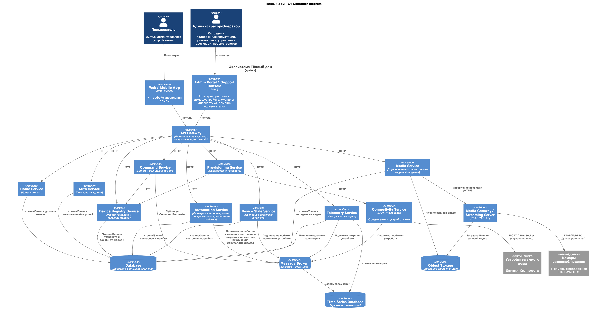
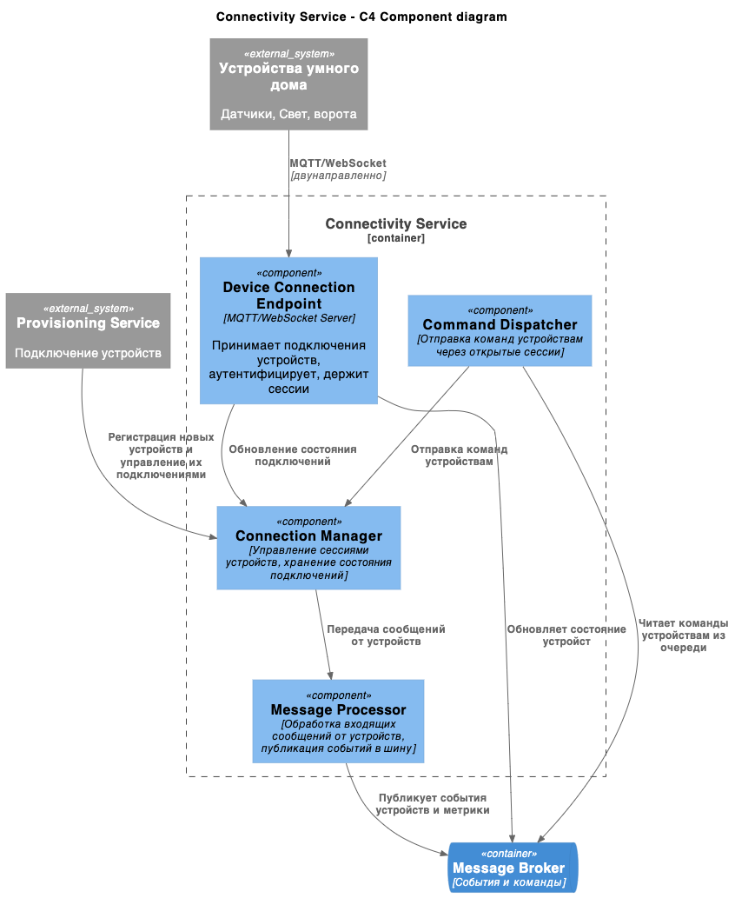
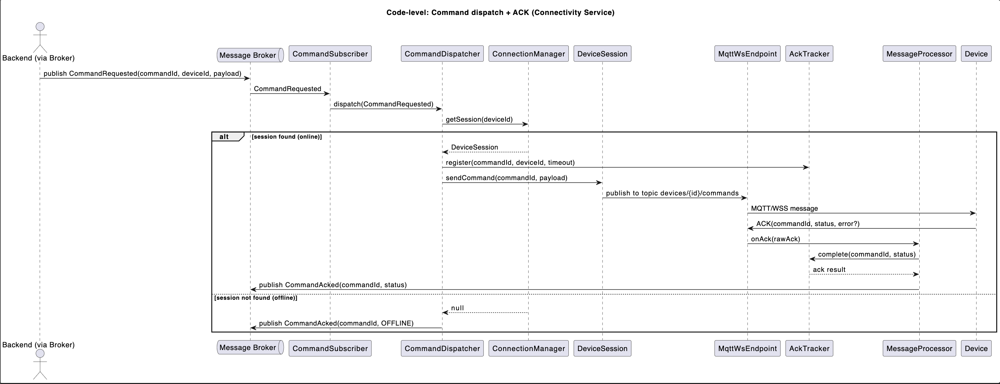
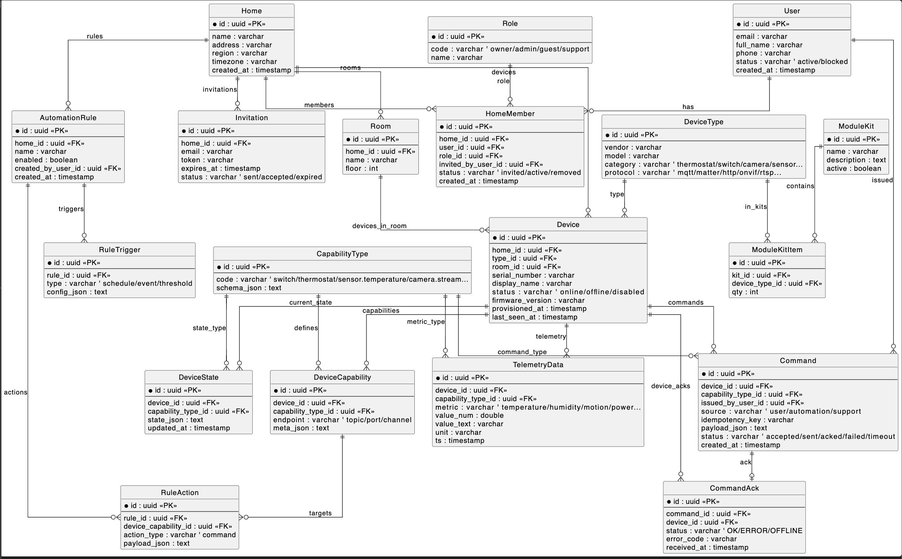

# Warm house

Это шаблон для решения проектной работы. Структура этого файла повторяет структуру заданий. Заполняйте его по мере работы над решением.

# Задание 1. Анализ и планирование

<aside>

Чтобы составить документ с описанием текущей архитектуры приложения, можно часть информации взять из описания компании и условия задания. Это нормально.

</aside

### 1. Описание функциональности монолитного приложения

**Управление отоплением:**

- Пользователи могут:
	Получить список всех датчикв
	Получить параметры датчика по его ID
	Добавить/удалить датчик
	Обновить параметры датчика по его id (Name,Type,Location,Value,Unit,Status)
	Обновлять значения датчика (Value,Status)
- Система поддерживает:
	Обновление данных датчиков температуры из внешнего API

**Мониторинг температуры:**

- Система получает данные о температуре с датчиков, установленных в домах. Пользователи могут просматривать текущую температуру в своих домах через веб-интерфейс (наверно он где то есть).

Код этой части я совсем не вижу, вижу только вызовы в стороннее апи из текущего сервиса. Судя по тому что можно вызвать можно получить температуру по датчку по его ID и Location.  
 
### 2. Анализ архитектуры монолитного приложения

*Язык программирования:* Go.
*СУБД:* PostgreSQL.
*Архитектура:* Монолитная, вся логика сосредоточена внутри одного приложения.
*Взаимодействие:* Синхронное выполнение всех операций.
*Масштабируемость:* Сложно масштабируется частями, требует перезапуска всей системы при изменениях.
*Развертывание:* Любое изменение влечет остановку всего приложения.

### 3. Определение доменов и границы контекстов

- Домен: Управление отоплением
	Поддомен: Регистрация устройств
	Поддомен: Обновление данных об устройствах
	Поддомен: Получение данных температуры

### **4. Проблемы монолитного решения**
 
- Не совсем понятно как им может пользоваться много пользоватлей если сущность пользователь вовсе отсутствует как и маппинг их с сенсорами. Получается если где то есть какой то WebUI в который ходят пользователи, то там доступно все для всех. 
- Как происходит включение/выключение датчика? 

Если вы считаете, что текущее решение не вызывает проблем, аргументируйте свою позицию.

### 5. Визуализация контекста системы — диаграмма С4

Добавьте сюда диаграмму контекста в модели C4.

Чтобы добавить ссылку в файл Readme.md, нужно использовать синтаксис Markdown. Это делают так:

```markdown
[Link](diagrams/container_AsIs.png)
```

# Задание 2. Проектирование микросервисной архитектуры

В этом задании вам нужно предоставить только диаграммы в модели C4. Мы не просим вас отдельно описывать получившиеся микросервисы и то, как вы определили взаимодействия между компонентами To-Be системы. Если вы правильно подготовите диаграммы C4, они и так это покажут.

**Диаграмма контейнеров (Containers)**



**Диаграмма компонентов (Components)**

./diagram/components_ToBe.puml



**Диаграмма кода (Code)**



# Задание 3. Разработка ER-диаграммы



# Задание 4. Создание и документирование API

### 1. Тип API

RestAPI 

### 2. Документация API

./swagger.yaml

# Задание 5. Работа с docker и docker-compose

Перейдите в apps.

Там находится приложение-монолит для работы с датчиками температуры. В README.md описано как запустить решение.

Вам нужно:

1) сделать простое приложение temperature-api на любом удобном для вас языке программирования, которое при запросе /temperature?location= будет отдавать рандомное значение температуры.

Locations - название комнаты, sensorId - идентификатор названия комнаты

```
	// If no location is provided, use a default based on sensor ID
	if location == "" {
		switch sensorID {
		case "1":
			location = "Living Room"
		case "2":
			location = "Bedroom"
		case "3":
			location = "Kitchen"
		default:
			location = "Unknown"
		}
	}

	// If no sensor ID is provided, generate one based on location
	if sensorID == "" {
		switch location {
		case "Living Room":
			sensorID = "1"
		case "Bedroom":
			sensorID = "2"
		case "Kitchen":
			sensorID = "3"
		default:
			sensorID = "0"
		}
	}
```

2) Приложение следует упаковать в Docker и добавить в docker-compose. Порт по умолчанию должен быть 8081

3) Кроме того для smart_home приложения требуется база данных - добавьте в docker-compose файл настройки для запуска postgres с указанием скрипта инициализации ./smart_home/init.sql

Для проверки можно использовать Postman коллекцию smarthome-api.postman_collection.json и вызвать:

- Create Sensor
- Get All Sensors

Должно при каждом вызове отображаться разное значение температуры

Ревьюер будет проверять точно так же.


# **Задание 6. Разработка MVP**

Необходимо создать новые микросервисы и обеспечить их интеграции с существующим монолитом для плавного перехода к микросервисной архитектуре. 

### **Что нужно сделать**

1. Создайте новые микросервисы для управления телеметрией и устройствами (с простейшей логикой), которые будут интегрированы с существующим монолитным приложением. Каждый микросервис на своем ООП языке.
2. Обеспечьте взаимодействие между микросервисами и монолитом (при желании с помощью брокера сообщений), чтобы постепенно перенести функциональность из монолита в микросервисы. 

В результате у вас должны быть созданы Dockerfiles и docker-compose для запуска микросервисов. 

Разработано